## LiikkumisApp

LiikkumisApp on käyttäjää tukeva urheilu aplikaatio. Käyttäjä pystyy seuraamaa miten hän on edistyny, voi seurata omaa ruokavaliotaan sekä tehä itselleen workoutteja mitä nuodattaa.

## Rautalankamalli
[Rautalankamalli](https://www.figma.com/file/C4hgU6YZl7PF0OLEaqAC9a/Untitled?type=design&node-id=1-5&mode=design&t=JBFiQK2WytOM06tc-0)

## Backend
* [upload-server](https://liikkumisapp.northeurope.cloudapp.azure.com/upload-api/api/v1/)
* [auth-server](https://liikkumisapp.northeurope.cloudapp.azure.com/auth-api/api/v1)
* [training-server](https://liikkumisapp.northeurope.cloudapp.azure.com/training-api/api/v1)

## apidocs
* [upload-server](https://liikkumisapp.northeurope.cloudapp.azure.com/upload-api/)
* [auth-server](https://liikkumisapp.northeurope.cloudapp.azure.com/auth-api/)
* [training-server](https://liikkumisapp.northeurope.cloudapp.azure.com/training-api/)

## backend testaukset
* [ci/cd](https://github.com/Aihki/Liikkumis-app-be/actions)
* [integraatio testaukset](https://github.com/Aihki/Liikkumis-app-be/tree/training-server/training-server/test)

## Tietokannan kuvaus

* [tietokanta](ss/liikkumisApp_diagram.png)

## Toimminnallisuudet

# Profile

 * Pystyt vaihtamaan profiilikluvaasi.
 * Saat motivaatio viestejä.
 * Pystyt lisäämään/seuraamaan omaa edistymistä.
 * voit vertailla uusimpia edistymisiäsi vanhempiin.
 * Näet personal best

 # Foodiary

 * pystyt lisäämään/seuraamaa omaa ruokavaliotasi.
 * voit lisätä lisätietoa ateriastasi

 # Chanllenges

* Pystyt osallistumaan erillaisiin haasteisiin.
* Pystyt filteröimään haasteet(running,strnght ja bodyweight)
* Pääset näkemään mihin haasteisiin olet osallistunut
* Näet prosenteina kuinka suuren osan olet jo tehnyt haasteesta
* Saat saavutuksia kun olet päässy jonkin haasteen loppuun asti.(bronze, silver, gold ja platinium)

# Exercise/workout

* Voit louda itsellesi treenin(gym, cardio tai body weight).
* Workouttiin voit sitten lisätä useamman liikeen(bench press)
* exercise sisältää liikeen, toistojen määrän, sarjojen määrän
* tämän lisäksi excercise voi sisältää painopt, kilometrin määrän. Tämä riippuu excerise tyypistä.
* Näet oman treeni historian
* Voit mennä  haasteisiin
* Pääset suoraan workoutin lisäämiseen navigaattorin sijaitsevasta + napista
* pääset näkemään liikeen tiedot (paino, sarjat, toistot sekä personal best)
* voit poistaa treenin
* liikeen voi poistaa sekä merkata tehdyksi
* kun kaikki liikeet on suoritettu niin treeni merkautuu suoritetuksi

# Home

* Voit mennä  haasteisiin
* Näet kalenterista treenipäiväsi

# Bugit

* foodiaryn poistaminen on hyvin tarkka mistä painaa
* foodiaryn lisäykset palasivat takas kun vaihtoi sivua(korjattu)
* progressin lisäys samaan päivään lisäsi sen olemassa oleviin(korjattu)

# Kuvankaappaukset

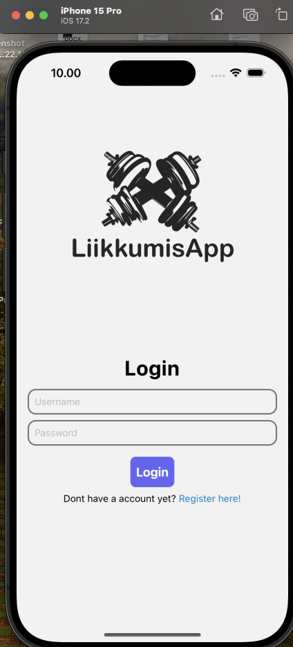
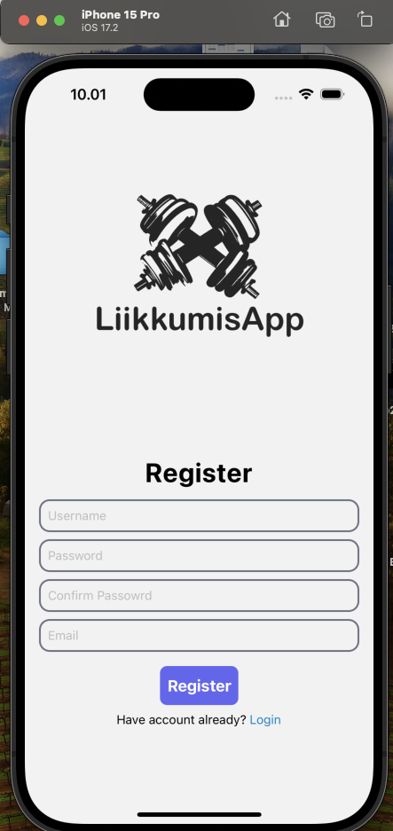
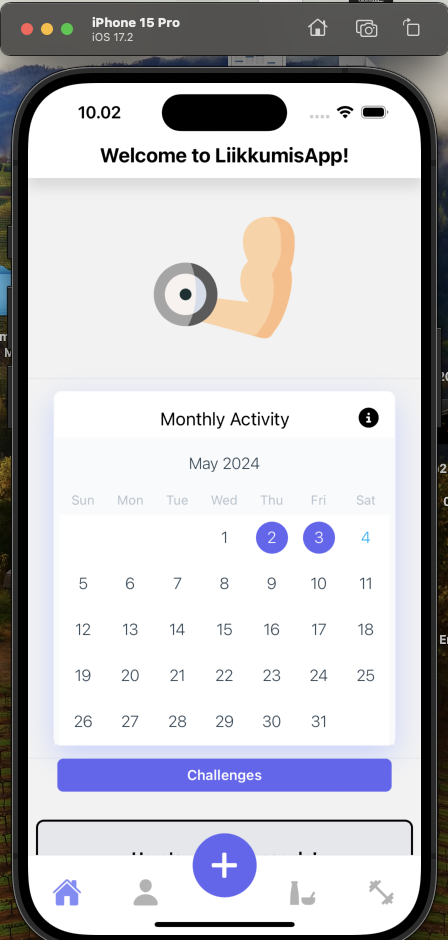
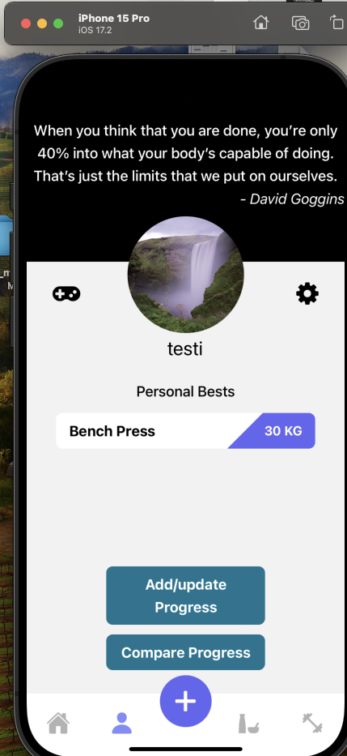
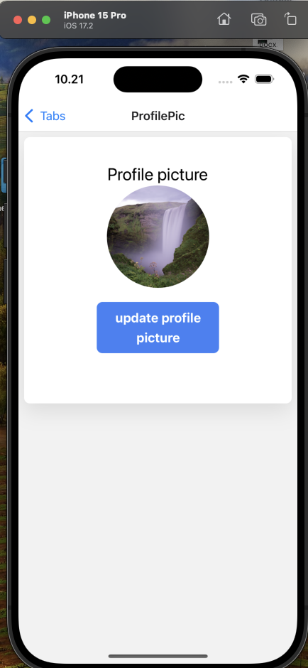
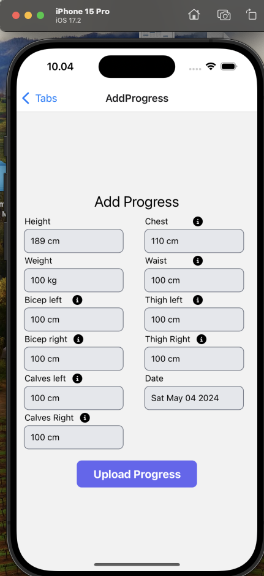
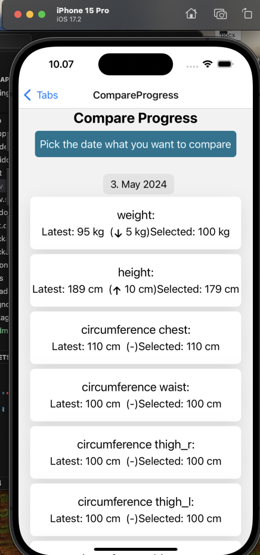
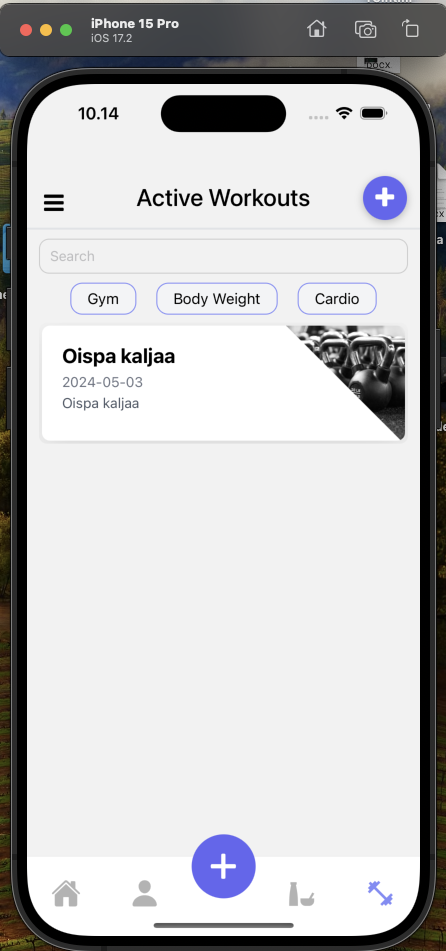
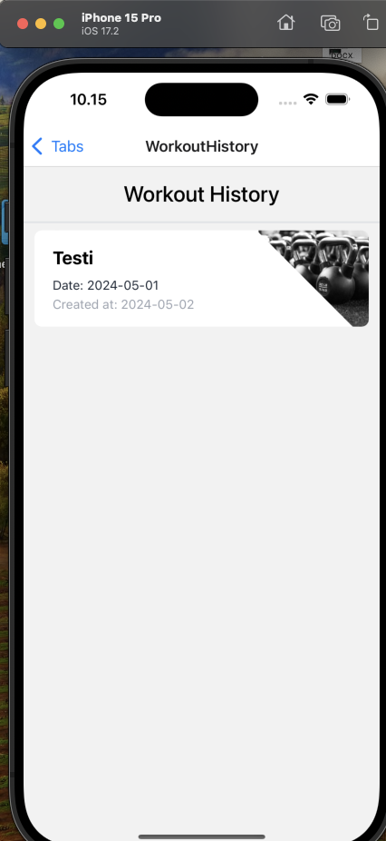
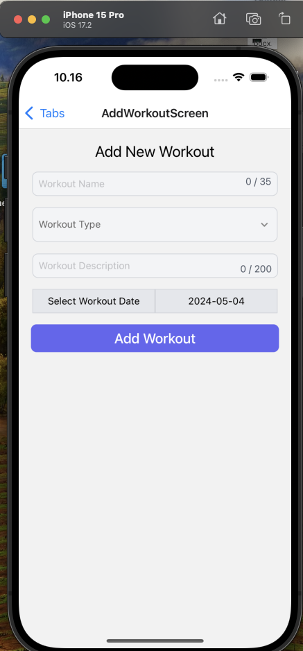
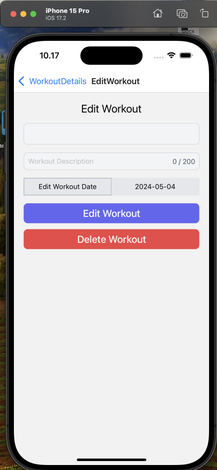
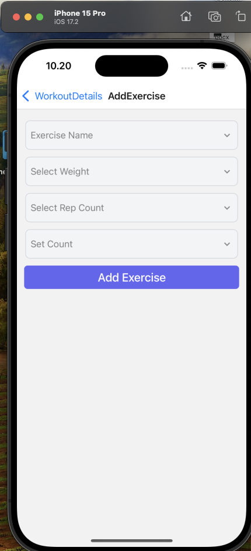
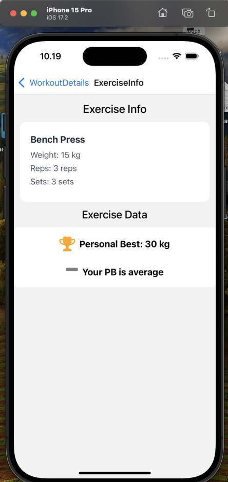
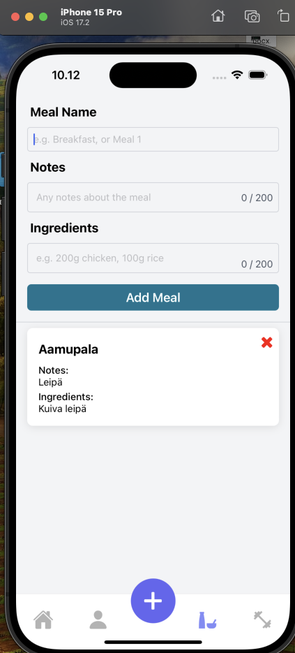
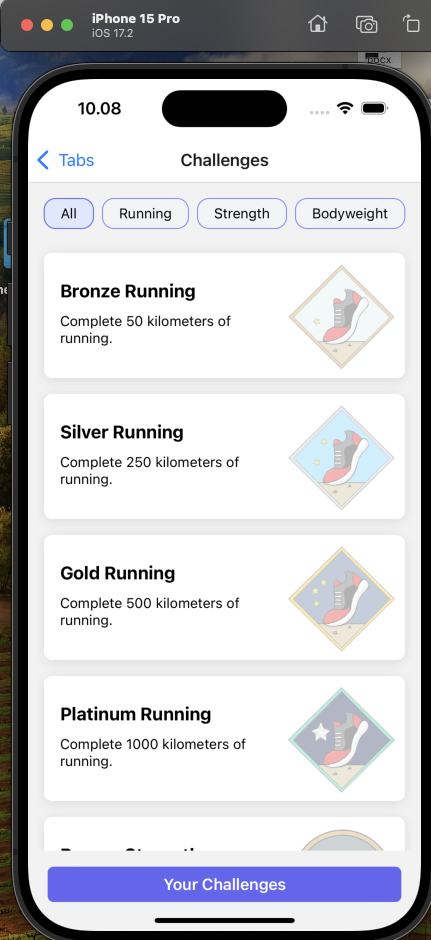
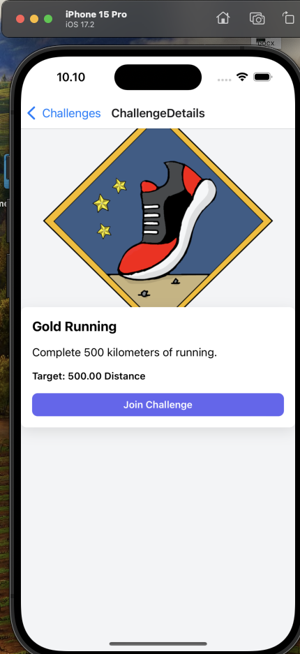
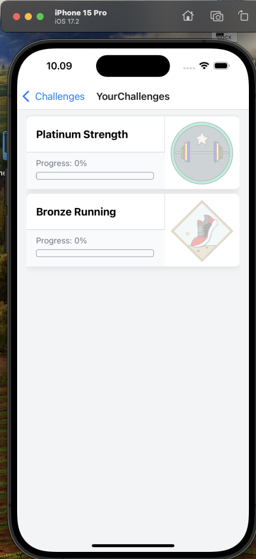
